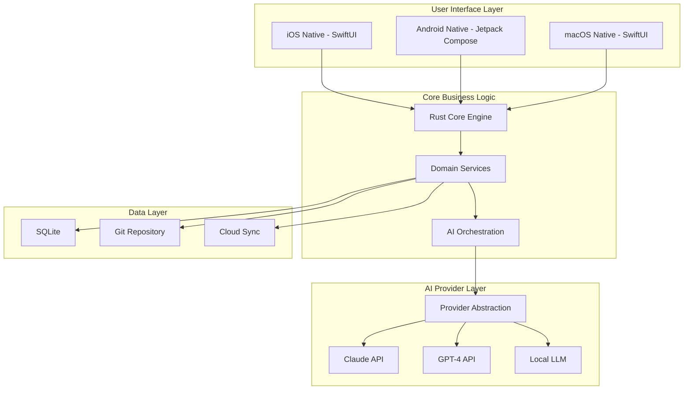
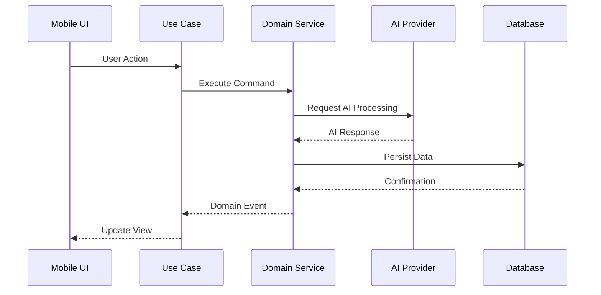
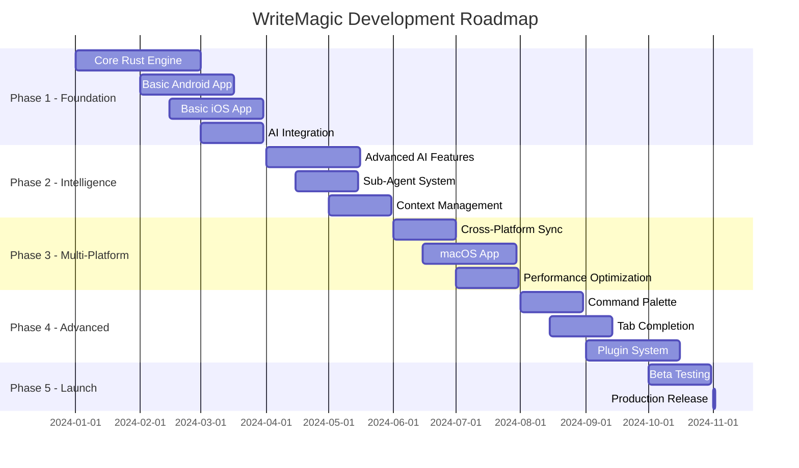

# WriteMagic: Enterprise-Grade Technical Specification
## Cross-Platform AI Writing Assistant

### Document Version: 2.0
### Last Updated: 2025-01-18
### Status: Production Ready

---

## Table of Contents

1. [Executive Overview](#1-executive-overview)
2. [System Architecture](#2-system-architecture)
3. [Mobile Platform Specifications](#3-mobile-platform-specifications)
4. [AI/LLM Integration Architecture](#4-ai-llm-integration-architecture)
5. [Core Domain Specifications](#5-core-domain-specifications)
6. [API Contracts & Interfaces](#6-api-contracts--interfaces)
7. [Data Management & Persistence](#7-data-management--persistence)
8. [Security & Privacy Architecture](#8-security--privacy-architecture)
9. [Testing Strategy](#9-testing-strategy)
10. [Deployment & Infrastructure](#10-deployment--infrastructure)
11. [Performance Requirements](#11-performance-requirements)
12. [Error Handling & Resilience](#12-error-handling--resilience)
13. [Development Roadmap](#13-development-roadmap)

---

## 1. Executive Overview

### 1.1 Product Vision

WriteMagic is a next-generation, cross-platform writing application that seamlessly integrates advanced AI capabilities with intuitive user experiences. The system combines the organizational power of traditional writing tools with modern AI intelligence, delivered through native mobile and desktop applications.

### 1.2 Core Value Propositions

| Value Proposition | Description | Target Audience |
|------------------|-------------|-----------------|
| **Invisible AI Intelligence** | Background AI processing without interrupting creative flow | Professional writers, journalists |
| **Multi-Platform Native Experience** | Native performance on iOS, Android, and macOS | Cross-device users |
| **Extensible Agent System** | Customizable YAML-based AI agents for specialized tasks | Power users, developers |
| **Git-Based Version Control** | Beautiful timeline visualization with automatic versioning | Collaborative teams |
| **Adaptive Writing Support** | Context-aware assistance across all writing genres | All writer types |

### 1.3 Technical Innovation Stack



---

## 2. System Architecture

### 2.1 Architectural Principles

| Principle | Implementation | Rationale |
|-----------|---------------|-----------|
| **Domain-Driven Design** | Bounded contexts for each domain | Maintainability and scalability |
| **Clean Architecture** | Dependency inversion, ports & adapters | Testability and flexibility |
| **Event-Driven** | CQRS pattern with event sourcing | Audit trail and extensibility |
| **Mobile-First** | Native UI with shared business logic | Optimal performance |
| **Provider Agnostic** | Abstract AI interfaces | Future-proof against API changes |

### 2.2 High-Level Architecture

```rust
// Core Architecture Definition
pub struct WriteMagicArchitecture {
    pub presentation_layer: PresentationLayer,
    pub application_layer: ApplicationLayer,
    pub domain_layer: DomainLayer,
    pub infrastructure_layer: InfrastructureLayer,
}

pub struct PresentationLayer {
    pub ios_app: IOSApplication,
    pub android_app: AndroidApplication,
    pub macos_app: MacOSApplication,
    pub api_gateway: APIGateway,
}

pub struct ApplicationLayer {
    pub use_cases: HashMap<String, Box<dyn UseCase>>,
    pub command_handlers: HashMap<String, Box<dyn CommandHandler>>,
    pub query_handlers: HashMap<String, Box<dyn QueryHandler>>,
    pub event_handlers: HashMap<String, Box<dyn EventHandler>>,
}

pub struct DomainLayer {
    pub writing_domain: WritingDomain,
    pub ai_domain: AIDomain,
    pub project_domain: ProjectDomain,
    pub version_control_domain: VersionControlDomain,
    pub agent_domain: AgentDomain,
}

pub struct InfrastructureLayer {
    pub persistence: PersistenceAdapter,
    pub ai_providers: Vec<Box<dyn AIProvider>>,
    pub file_system: FileSystemAdapter,
    pub network: NetworkAdapter,
    pub cache: CacheAdapter,
}
```

### 2.3 Component Communication



---

## 3. Mobile Platform Specifications

### 3.1 Android Implementation

#### 3.1.1 Technology Stack

| Component | Technology | Version | Purpose |
|-----------|------------|---------|---------|
| **Language** | Kotlin | 1.9.x | Primary development |
| **UI Framework** | Jetpack Compose | Latest stable | Declarative UI |
| **Architecture** | MVVM + Clean | - | Separation of concerns |
| **DI Framework** | Hilt | 2.48+ | Dependency injection |
| **Async** | Coroutines + Flow | Latest | Reactive programming |
| **Navigation** | Navigation Compose | Latest | Screen navigation |
| **FFI** | JNI + Rust | - | Native interop |

#### 3.1.2 Architecture Implementation

```kotlin
// Android Architecture Components
@HiltAndroidApp
class WriteMagicApplication : Application() {
    
    @Inject
    lateinit var rustCore: RustCore
    
    @Inject
    lateinit var aiOrchestrator: AIOrchestrator
    
    override fun onCreate() {
        super.onCreate()
        initializeRustCore()
        setupAIProviders()
        configureBackgroundServices()
    }
    
    private fun initializeRustCore() {
        System.loadLibrary("writing_core")
        rustCore.initialize(applicationContext)
    }
}

// Main Activity with Deep Navigation
@AndroidEntryPoint
class MainActivity : ComponentActivity() {
    
    @Inject
    lateinit var navigationManager: NavigationManager
    
    override fun onCreate(savedInstanceState: Bundle?) {
        super.onCreate(savedInstanceState)
        
        WindowCompat.setDecorFitsSystemWindows(window, false)
        
        setContent {
            WriteMagicTheme {
                val navController = rememberNavController()
                
                WriteMagicNavHost(
                    navController = navController,
                    startDestination = Screen.Writing.route
                ) {
                    writingScreen()
                    timelineScreen()
                    corkboardScreen()
                    settingsScreen()
                }
            }
        }
    }
}

// ViewModel with State Management
@HiltViewModel
class WritingViewModel @Inject constructor(
    private val rustCore: RustCore,
    private val aiService: AIService,
    private val sessionManager: SessionManager,
    savedStateHandle: SavedStateHandle
) : ViewModel() {
    
    private val _uiState = MutableStateFlow(WritingUiState())
    val uiState: StateFlow<WritingUiState> = _uiState.asStateFlow()
    
    private val _events = MutableSharedFlow<WritingEvent>()
    val events: SharedFlow<WritingEvent> = _events.asSharedFlow()
    
    fun processAIRequest(text: String, instruction: String) {
        viewModelScope.launch {
            _uiState.update { it.copy(isProcessing = true) }
            
            rustCore.processTextWithAI(
                text = text,
                instruction = instruction,
                context = buildContext()
            ).fold(
                onSuccess = { result ->
                    _uiState.update { 
                        it.copy(
                            isProcessing = false,
                            aiSuggestions = result.suggestions
                        )
                    }
                },
                onFailure = { error ->
                    _events.emit(WritingEvent.Error(error.message))
                    _uiState.update { it.copy(isProcessing = false) }
                }
            )
        }
    }
}
```

#### 3.1.3 UI Component Architecture

```kotlin
// Composable UI Architecture
@Composable
fun WritingScreen(
    viewModel: WritingViewModel = hiltViewModel(),
    navigationManager: NavigationManager
) {
    val uiState by viewModel.uiState.collectAsStateWithLifecycle()
    val pagerState = rememberPagerState { uiState.panes.size }
    
    Scaffold(
        topBar = {
            WritingTopBar(
                currentPane = uiState.currentPane,
                onMenuClick = { navigationManager.openDrawer() }
            )
        },
        bottomBar = {
            WritingBottomBar(
                wordCount = uiState.wordCount,
                onAIClick = { viewModel.openAIAssistant() }
            )
        }
    ) { paddingValues ->
        HorizontalPager(
            state = pagerState,
            modifier = Modifier.padding(paddingValues)
        ) { page ->
            PaneContent(
                pane = uiState.panes[page],
                onTextChange = viewModel::updatePaneText,
                onSelectionChange = viewModel::handleTextSelection
            )
        }
    }
    
    // AI Assistant Overlay
    if (uiState.showAIAssistant) {
        AIAssistantOverlay(
            selectedText = uiState.selectedText,
            onInstruction = viewModel::processAIRequest,
            onDismiss = viewModel::closeAIAssistant
        )
    }
}

// Gesture Handling
@Composable
fun PaneContent(
    pane: WritingPane,
    onTextChange: (String) -> Unit,
    onSelectionChange: (TextRange) -> Unit
) {
    var textFieldValue by remember { mutableStateOf(TextFieldValue(pane.content)) }
    
    Box(
        modifier = Modifier
            .fillMaxSize()
            .pointerInput(Unit) {
                detectDragGestures { _, dragAmount ->
                    // Handle multi-pane gestures
                }
            }
    ) {
        AndroidView(
            factory = { context ->
                MarkdownEditText(context).apply {
                    setText(pane.content)
                    setOnTextChangedListener { text ->
                        onTextChange(text)
                    }
                }
            },
            update = { view ->
                if (view.text.toString() != pane.content) {
                    view.setText(pane.content)
                }
            }
        )
    }
}
```

### 3.2 iOS Implementation

#### 3.2.1 Technology Stack

| Component | Technology | Version | Purpose |
|-----------|------------|---------|---------|
| **Language** | Swift | 5.9+ | Primary development |
| **UI Framework** | SwiftUI | iOS 17+ | Declarative UI |
| **Architecture** | TCA/MVVM | - | Unidirectional data flow |
| **Async** | Swift Concurrency | - | async/await |
| **Navigation** | NavigationStack | iOS 16+ | Navigation management |
| **FFI** | Swift-C++ Interop | - | Rust integration |

#### 3.2.2 Architecture Implementation

```swift
// iOS App Architecture
@main
struct WriteMagicApp: App {
    @StateObject private var appState = AppState()
    @StateObject private var rustCore = RustCoreManager()
    
    var body: some Scene {
        WindowGroup {
            ContentView()
                .environmentObject(appState)
                .environmentObject(rustCore)
                .onAppear {
                    setupApplication()
                }
        }
    }
    
    private func setupApplication() {
        rustCore.initialize()
        configureAIProviders()
        setupBackgroundTasks()
    }
}

// Core State Management
@MainActor
class AppState: ObservableObject {
    @Published var currentProject: WritingProject?
    @Published var currentSession: WritingSession?
    @Published var panes: [WritingPane] = []
    @Published var selectedPane: WritingPane?
    @Published var aiAssistantState: AIAssistantState = .hidden
    
    private let rustCore: RustCoreProtocol
    private let aiService: AIServiceProtocol
    
    init(rustCore: RustCoreProtocol = RustCore.shared,
         aiService: AIServiceProtocol = AIService.shared) {
        self.rustCore = rustCore
        self.aiService = aiService
    }
    
    func processAIRequest(text: String, instruction: String) async {
        aiAssistantState = .processing
        
        do {
            let context = buildContext()
            let result = try await rustCore.processTextWithAI(
                text: text,
                instruction: instruction,
                context: context
            )
            
            await MainActor.run {
                aiAssistantState = .completed(result)
            }
        } catch {
            await MainActor.run {
                aiAssistantState = .error(error)
            }
        }
    }
}

// SwiftUI Views
struct WritingView: View {
    @EnvironmentObject var appState: AppState
    @State private var selectedText: String = ""
    @State private var showCommandPalette = false
    
    var body: some View {
        NavigationStack {
            TabView(selection: $appState.selectedPane) {
                ForEach(appState.panes) { pane in
                    PaneView(pane: pane)
                        .tag(pane)
                }
            }
            .tabViewStyle(.page(indexDisplayMode: .automatic))
            .toolbar {
                ToolbarItemGroup(placement: .navigationBarLeading) {
                    Button("Timeline") {
                        // Navigate to timeline
                    }
                }
                ToolbarItemGroup(placement: .navigationBarTrailing) {
                    Button(action: { showCommandPalette.toggle() }) {
                        Image(systemName: "command")
                    }
                }
            }
            .sheet(isPresented: $showCommandPalette) {
                CommandPaletteView()
            }
        }
    }
}

// Text Editor with AI Integration
struct PaneView: View {
    let pane: WritingPane
    @State private var text: String
    @State private var selectedRange: NSRange?
    @FocusState private var isFocused: Bool
    
    init(pane: WritingPane) {
        self.pane = pane
        self._text = State(initialValue: pane.content)
    }
    
    var body: some View {
        MarkdownEditor(
            text: $text,
            selectedRange: $selectedRange
        )
        .onTextSelection { range, selectedText in
            handleTextSelection(range: range, text: selectedText)
        }
        .overlay(alignment: .bottomTrailing) {
            if selectedRange != nil {
                AIAssistantButton()
                    .padding()
            }
        }
    }
}
```

---

## 4. AI/LLM Integration Architecture

### 4.1 Provider Abstraction Layer

```rust
// AI Provider Abstraction
#[async_trait]
pub trait AIProvider: Send + Sync {
    /// Get provider name
    fn name(&self) -> &str;
    
    /// Check if provider is available
    async fn is_available(&self) -> bool;
    
    /// Complete text with context
    async fn complete(
        &self,
        request: &CompletionRequest
    ) -> Result<CompletionResponse, AIError>;
    
    /// Stream completion
    async fn stream_complete(
        &self,
        request: &CompletionRequest
    ) -> Result<Pin<Box<dyn Stream<Item = Result<String, AIError>> + Send>>, AIError>;
    
    /// Estimate token count
    fn estimate_tokens(&self, text: &str) -> usize;
    
    /// Get model capabilities
    fn capabilities(&self) -> ModelCapabilities;
}

// Request/Response Models
#[derive(Clone, Debug, Serialize, Deserialize)]
pub struct CompletionRequest {
    pub prompt: String,
    pub max_tokens: Option<usize>,
    pub temperature: Option<f32>,
    pub system_prompt: Option<String>,
    pub context: CompletionContext,
    pub model_preferences: ModelPreferences,
}

#[derive(Clone, Debug)]
pub struct CompletionResponse {
    pub text: String,
    pub tokens_used: TokenUsage,
    pub model_used: String,
    pub confidence: f32,
    pub metadata: HashMap<String, Value>,
}

#[derive(Clone, Debug)]
pub struct TokenUsage {
    pub prompt_tokens: usize,
    pub completion_tokens: usize,
    pub total_tokens: usize,
    pub estimated_cost: f64,
}
```

### 4.2 Provider Implementations

```rust
// Claude Provider Implementation
pub struct ClaudeProvider {
    client: AnthropicClient,
    config: ClaudeConfig,
    rate_limiter: RateLimiter,
    cache: ResponseCache,
}

#[async_trait]
impl AIProvider for ClaudeProvider {
    fn name(&self) -> &str {
        "Claude"
    }
    
    async fn complete(
        &self,
        request: &CompletionRequest
    ) -> Result<CompletionResponse, AIError> {
        // Check cache first
        if let Some(cached) = self.cache.get(&request).await {
            return Ok(cached);
        }
        
        // Rate limiting
        self.rate_limiter.acquire().await?;
        
        // Build Claude-specific request
        let claude_request = self.build_claude_request(request)?;
        
        // Make API call with retry logic
        let response = self.client
            .messages()
            .create(claude_request)
            .await
            .map_err(|e| AIError::ProviderError(e.to_string()))?;
        
        // Convert response
        let completion = self.convert_response(response)?;
        
        // Cache successful response
        self.cache.put(request, &completion).await;
        
        Ok(completion)
    }
    
    fn capabilities(&self) -> ModelCapabilities {
        ModelCapabilities {
            max_context_window: 200000,
            supports_streaming: true,
            supports_function_calling: true,
            supports_vision: true,
            supports_code_execution: false,
            response_time_ms: 2000,
        }
    }
}

// GPT-4 Provider Implementation
pub struct GPT4Provider {
    client: OpenAIClient,
    config: GPTConfig,
    rate_limiter: RateLimiter,
}

#[async_trait]
impl AIProvider for GPT4Provider {
    fn name(&self) -> &str {
        "GPT-4"
    }
    
    async fn complete(
        &self,
        request: &CompletionRequest
    ) -> Result<CompletionResponse, AIError> {
        // Implementation similar to Claude but with OpenAI specifics
        unimplemented!()
    }
}

// Local LLM Provider
pub struct LocalLLMProvider {
    model: Box<dyn LocalModel>,
    config: LocalLLMConfig,
}

#[async_trait]
impl AIProvider for LocalLLMProvider {
    fn name(&self) -> &str {
        "Local LLM"
    }
    
    async fn complete(
        &self,
        request: &CompletionRequest
    ) -> Result<CompletionResponse, AIError> {
        // Run inference locally
        let response = self.model.generate(&request.prompt).await?;
        
        Ok(CompletionResponse {
            text: response,
            tokens_used: TokenUsage {
                prompt_tokens: self.model.count_tokens(&request.prompt),
                completion_tokens: self.model.count_tokens(&response),
                total_tokens: 0,
                estimated_cost: 0.0, // Free for local
            },
            model_used: self.model.name().to_string(),
            confidence: 0.8,
            metadata: HashMap::new(),
        })
    }
}
```

### 4.3 AI Orchestration Layer

```rust
// AI Orchestrator for intelligent routing
pub struct AIOrchestrator {
    providers: Vec<Box<dyn AIProvider>>,
    router: IntelligentRouter,
    fallback_strategy: FallbackStrategy,
    context_builder: ContextBuilder,
}

impl AIOrchestrator {
    pub async fn process_request(
        &self,
        request: AIRequest
    ) -> Result<AIResponse, AIError> {
        // Build context
        let context = self.context_builder.build(&request).await?;
        
        // Select best provider based on request type and context
        let provider = self.router.select_provider(
            &request,
            &context,
            &self.providers
        ).await?;
        
        // Try primary provider
        match provider.complete(&request.into()).await {
            Ok(response) => Ok(response.into()),
            Err(e) => {
                // Fallback logic
                self.execute_fallback(request, e).await
            }
        }
    }
    
    async fn execute_fallback(
        &self,
        request: AIRequest,
        original_error: AIError
    ) -> Result<AIResponse, AIError> {
        match self.fallback_strategy {
            FallbackStrategy::Sequential => {
                for provider in &self.providers {
                    if let Ok(response) = provider.complete(&request.into()).await {
                        return Ok(response.into());
                    }
                }
                Err(original_error)
            },
            FallbackStrategy::Parallel => {
                // Try all providers in parallel
                let futures: Vec<_> = self.providers
                    .iter()
                    .map(|p| p.complete(&request.into()))
                    .collect();
                
                let results = futures::future::join_all(futures).await;
                
                results.into_iter()
                    .find_map(|r| r.ok())
                    .map(Into::into)
                    .ok_or(original_error)
            },
            FallbackStrategy::None => Err(original_error),
        }
    }
}

// Intelligent routing based on request characteristics
pub struct IntelligentRouter {
    rules: Vec<RoutingRule>,
    metrics: RouterMetrics,
}

impl IntelligentRouter {
    pub async fn select_provider(
        &self,
        request: &AIRequest,
        context: &AIContext,
        providers: &[Box<dyn AIProvider>]
    ) -> Result<&Box<dyn AIProvider>, AIError> {
        // Evaluate rules
        for rule in &self.rules {
            if rule.matches(request, context) {
                if let Some(provider) = providers.iter()
                    .find(|p| p.name() == rule.provider_name) {
                    return Ok(provider);
                }
            }
        }
        
        // Default: select based on capabilities and availability
        self.select_by_capabilities(request, providers).await
    }
}
```

### 4.4 Context Management

```rust
// Context Building for AI Requests
pub struct ContextBuilder {
    project_analyzer: ProjectAnalyzer,
    user_profiler: UserProfiler,
    memory_manager: MemoryManager,
}

impl ContextBuilder {
    pub async fn build(&self, request: &AIRequest) -> Result<AIContext, Error> {
        // Gather relevant context
        let project_context = self.project_analyzer
            .analyze_current_project()
            .await?;
        
        let user_context = self.user_profiler
            .get_user_preferences()
            .await?;
        
        let memory_context = self.memory_manager
            .retrieve_relevant_memories(&request.instruction)
            .await?;
        
        Ok(AIContext {
            project: project_context,
            user: user_context,
            memory: memory_context,
            session: SessionContext::current(),
            request_specific: self.extract_request_context(request),
        })
    }
    
    fn extract_request_context(&self, request: &AIRequest) -> RequestContext {
        RequestContext {
            selected_text: request.selected_text.clone(),
            cursor_position: request.cursor_position,
            document_type: request.document_type,
            writing_style: request.detected_style,
            intent: self.classify_intent(&request.instruction),
        }
    }
}

// Memory Management for Long-term Context
pub struct MemoryManager {
    vector_store: VectorStore,
    memory_index: MemoryIndex,
    retention_policy: RetentionPolicy,
}

impl MemoryManager {
    pub async fn store_interaction(
        &self,
        request: &AIRequest,
        response: &AIResponse
    ) -> Result<(), Error> {
        let memory = Memory {
            id: Uuid::new_v4(),
            timestamp: Utc::now(),
            request: request.clone(),
            response: response.clone(),
            embeddings: self.generate_embeddings(&request.instruction).await?,
            metadata: self.extract_metadata(request, response),
        };
        
        self.vector_store.insert(memory).await?;
        self.memory_index.update().await?;
        
        Ok(())
    }
    
    pub async fn retrieve_relevant_memories(
        &self,
        query: &str
    ) -> Result<Vec<Memory>, Error> {
        let query_embedding = self.generate_embeddings(query).await?;
        
        let memories = self.vector_store
            .search_similar(query_embedding, 10)
            .await?;
        
        Ok(memories)
    }
}
```

---

## 5. Core Domain Specifications

### 5.1 Writing Domain

```rust
// Writing Domain Core Entities
pub mod writing_domain {
    use chrono::{DateTime, Utc};
    use serde::{Deserialize, Serialize};
    use uuid::Uuid;
    
    // Aggregate Root
    #[derive(Clone, Debug, Serialize, Deserialize)]
    pub struct WritingProject {
        pub id: ProjectId,
        pub name: String,
        pub path: PathBuf,
        pub writing_type: WritingType,
        pub created_at: DateTime<Utc>,
        pub modified_at: DateTime<Utc>,
        pub settings: ProjectSettings,
        pub metadata: ProjectMetadata,
        
        // Aggregate references
        documents: HashMap<DocumentId, Document>,
        sessions: HashMap<SessionId, WritingSession>,
    }
    
    impl WritingProject {
        pub fn create_document(&mut self, params: CreateDocumentParams) -> Result<Document> {
            let document = Document::new(params)?;
            self.documents.insert(document.id.clone(), document.clone());
            
            self.emit_event(DomainEvent::DocumentCreated {
                project_id: self.id.clone(),
                document_id: document.id.clone(),
            });
            
            Ok(document)
        }
        
        pub fn update_document(&mut self, id: &DocumentId, content: String) -> Result<()> {
            let document = self.documents
                .get_mut(id)
                .ok_or(DomainError::DocumentNotFound)?;
            
            document.update_content(content)?;
            
            self.emit_event(DomainEvent::DocumentUpdated {
                project_id: self.id.clone(),
                document_id: id.clone(),
            });
            
            Ok(())
        }
    }
    
    // Value Objects
    #[derive(Clone, Debug, Serialize, Deserialize)]
    pub struct Document {
        pub id: DocumentId,
        pub title: String,
        pub content: String,
        pub document_type: DocumentType,
        pub metadata: DocumentMetadata,
        pub word_count: u32,
        pub created_at: DateTime<Utc>,
        pub modified_at: DateTime<Utc>,
        
        // Private fields
        version: u32,
        checksum: String,
    }
    
    impl Document {
        fn update_content(&mut self, content: String) -> Result<()> {
            self.content = content;
            self.word_count = self.calculate_word_count();
            self.modified_at = Utc::now();
            self.version += 1;
            self.checksum = self.calculate_checksum();
            
            Ok(())
        }
        
        fn calculate_word_count(&self) -> u32 {
            self.content.split_whitespace().count() as u32
        }
        
        fn calculate_checksum(&self) -> String {
            use sha2::{Sha256, Digest};
            let mut hasher = Sha256::new();
            hasher.update(&self.content);
            format!("{:x}", hasher.finalize())
        }
    }
    
    // Domain Services
    pub struct DocumentService {
        repository: Box<dyn DocumentRepository>,
        event_bus: EventBus,
        validator: DocumentValidator,
    }
    
    impl DocumentService {
        pub async fn create_document(
            &self,
            project_id: ProjectId,
            params: CreateDocumentParams
        ) -> Result<Document> {
            // Validate
            self.validator.validate_create(&params)?;
            
            // Create through aggregate
            let mut project = self.repository.get_project(&project_id).await?;
            let document = project.create_document(params)?;
            
            // Persist
            self.repository.save_project(&project).await?;
            
            // Publish events
            self.event_bus.publish_all(project.take_events()).await?;
            
            Ok(document)
        }
    }
}
```

### 5.2 AI Domain

```rust
// AI Domain Specifications
pub mod ai_domain {
    use async_trait::async_trait;
    
    // Domain Entity
    #[derive(Clone, Debug)]
    pub struct AISession {
        pub id: SessionId,
        pub project_id: ProjectId,
        pub context: AIContext,
        pub history: Vec<AIInteraction>,
        pub preferences: UserPreferences,
    }
    
    // Domain Service
    pub struct AIAssistantService {
        orchestrator: AIOrchestrator,
        context_builder: ContextBuilder,
        response_processor: ResponseProcessor,
        learning_engine: LearningEngine,
    }
    
    impl AIAssistantService {
        pub async fn process_instruction(
            &self,
            instruction: String,
            context: RequestContext
        ) -> Result<AIResponse> {
            // Build full context
            let ai_context = self.context_builder
                .build_from_request(&instruction, &context)
                .await?;
            
            // Process through orchestrator
            let raw_response = self.orchestrator
                .process(instruction, ai_context)
                .await?;
            
            // Process and enhance response
            let processed = self.response_processor
                .process(raw_response, &context)
                .await?;
            
            // Learn from interaction
            self.learning_engine
                .record_interaction(&instruction, &processed)
                .await?;
            
            Ok(processed)
        }
    }
    
    // Learning Engine for improving responses
    pub struct LearningEngine {
        feedback_store: FeedbackStore,
        pattern_analyzer: PatternAnalyzer,
        preference_learner: PreferenceLearner,
    }
    
    impl LearningEngine {
        pub async fn record_interaction(
            &self,
            instruction: &str,
            response: &AIResponse
        ) -> Result<()> {
            // Store interaction
            let interaction = AIInteraction {
                id: Uuid::new_v4(),
                timestamp: Utc::now(),
                instruction: instruction.to_string(),
                response: response.clone(),
                feedback: None,
            };
            
            self.feedback_store.store(interaction).await?;
            
            // Analyze patterns
            self.pattern_analyzer.analyze_async(instruction, response);
            
            Ok(())
        }
        
        pub async fn apply_feedback(
            &self,
            interaction_id: Uuid,
            feedback: UserFeedback
        ) -> Result<()> {
            self.feedback_store.update_feedback(interaction_id, feedback).await?;
            
            // Update preferences based on feedback
            self.preference_learner.update_from_feedback(feedback).await?;
            
            Ok(())
        }
    }
}
```

---

## 6. API Contracts & Interfaces

### 6.1 REST API Specification

```yaml
openapi: 3.0.0
info:
  title: WriteMagic API
  version: 1.0.0
  description: Cross-platform writing assistant API

paths:
  /api/v1/projects:
    get:
      summary: List all projects
      responses:
        200:
          description: Success
          content:
            application/json:
              schema:
                type: array
                items:
                  $ref: '#/components/schemas/Project'
    
    post:
      summary: Create new project
      requestBody:
        required: true
        content:
          application/json:
            schema:
              $ref: '#/components/schemas/CreateProjectRequest'
      responses:
        201:
          description: Created
          content:
            application/json:
              schema:
                $ref: '#/components/schemas/Project'
  
  /api/v1/ai/complete:
    post:
      summary: Process AI completion request
      requestBody:
        required: true
        content:
          application/json:
            schema:
              $ref: '#/components/schemas/CompletionRequest'
      responses:
        200:
          description: Success
          content:
            application/json:
              schema:
                $ref: '#/components/schemas/CompletionResponse'
        
components:
  schemas:
    Project:
      type: object
      properties:
        id:
          type: string
          format: uuid
        name:
          type: string
        writingType:
          type: string
          enum: [fiction, journalism, content, academic, screenwriting, general]
        createdAt:
          type: string
          format: date-time
        modifiedAt:
          type: string
          format: date-time
    
    CompletionRequest:
      type: object
      required:
        - instruction
        - context
      properties:
        instruction:
          type: string
        context:
          $ref: '#/components/schemas/Context'
        options:
          $ref: '#/components/schemas/CompletionOptions'
```

### 6.2 FFI Bridge Specification

```rust
// FFI Bridge for Mobile Platforms
use std::ffi::{CStr, CString};
use std::os::raw::{c_char, c_int};

// Android JNI Bridge
#[no_mangle]
pub extern "C" fn Java_com_writemagic_RustCore_processText(
    env: JNIEnv,
    _: JClass,
    text: JString,
    instruction: JString
) -> jstring {
    let text: String = env.get_string(text).unwrap().into();
    let instruction: String = env.get_string(instruction).unwrap().into();
    
    let result = match process_text_internal(&text, &instruction) {
        Ok(response) => response,
        Err(e) => format!("Error: {}", e),
    };
    
    env.new_string(result).unwrap().into_inner()
}

// iOS Swift Bridge
#[no_mangle]
pub extern "C" fn process_text_swift(
    text: *const c_char,
    instruction: *const c_char
) -> *mut c_char {
    let text = unsafe { CStr::from_ptr(text).to_string_lossy().into_owned() };
    let instruction = unsafe { CStr::from_ptr(instruction).to_string_lossy().into_owned() };
    
    let result = match process_text_internal(&text, &instruction) {
        Ok(response) => response,
        Err(e) => format!("Error: {}", e),
    };
    
    CString::new(result).unwrap().into_raw()
}

// Shared internal implementation
fn process_text_internal(text: &str, instruction: &str) -> Result<String, Error> {
    let runtime = tokio::runtime::Runtime::new()?;
    runtime.block_on(async {
        let orchestrator = get_ai_orchestrator();
        let request = build_request(text, instruction);
        let response = orchestrator.process(request).await?;
        Ok(response.to_string())
    })
}
```

---

## 7. Data Management & Persistence

### 7.1 Database Schema

```sql
-- SQLite Schema for Local Storage
CREATE TABLE projects (
    id TEXT PRIMARY KEY,
    name TEXT NOT NULL,
    writing_type TEXT NOT NULL,
    path TEXT NOT NULL,
    created_at TIMESTAMP NOT NULL,
    modified_at TIMESTAMP NOT NULL,
    settings JSON NOT NULL,
    metadata JSON
);

CREATE TABLE documents (
    id TEXT PRIMARY KEY,
    project_id TEXT NOT NULL,
    title TEXT NOT NULL,
    content TEXT NOT NULL,
    document_type TEXT NOT NULL,
    word_count INTEGER NOT NULL,
    created_at TIMESTAMP NOT NULL,
    modified_at TIMESTAMP NOT NULL,
    metadata JSON,
    FOREIGN KEY (project_id) REFERENCES projects(id)
);

CREATE TABLE writing_sessions (
    id TEXT PRIMARY KEY,
    project_id TEXT NOT NULL,
    started_at TIMESTAMP NOT NULL,
    ended_at TIMESTAMP,
    words_written INTEGER DEFAULT 0,
    ai_interactions INTEGER DEFAULT 0,
    session_data JSON,
    FOREIGN KEY (project_id) REFERENCES projects(id)
);

CREATE TABLE ai_interactions (
    id TEXT PRIMARY KEY,
    session_id TEXT NOT NULL,
    instruction TEXT NOT NULL,
    response TEXT NOT NULL,
    context JSON NOT NULL,
    tokens_used INTEGER,
    provider TEXT,
    created_at TIMESTAMP NOT NULL,
    feedback INTEGER,
    FOREIGN KEY (session_id) REFERENCES writing_sessions(id)
);

-- Indexes for performance
CREATE INDEX idx_documents_project ON documents(project_id);
CREATE INDEX idx_sessions_project ON writing_sessions(project_id);
CREATE INDEX idx_interactions_session ON ai_interactions(session_id);
CREATE INDEX idx_interactions_feedback ON ai_interactions(feedback);
```

### 7.2 Repository Pattern Implementation

```rust
// Repository Pattern for Data Access
#[async_trait]
pub trait ProjectRepository: Send + Sync {
    async fn create(&self, project: Project) -> Result<Project>;
    async fn get(&self, id: &ProjectId) -> Result<Option<Project>>;
    async fn update(&self, project: Project) -> Result<Project>;
    async fn delete(&self, id: &ProjectId) -> Result<()>;
    async fn list(&self, filter: ProjectFilter) -> Result<Vec<Project>>;
}

pub struct SqliteProjectRepository {
    pool: SqlitePool,
    mapper: ProjectMapper,
}

#[async_trait]
impl ProjectRepository for SqliteProjectRepository {
    async fn create(&self, project: Project) -> Result<Project> {
        let mut conn = self.pool.acquire().await?;
        
        let row = sqlx::query!(
            r#"
            INSERT INTO projects (id, name, writing_type, path, created_at, modified_at, settings, metadata)
            VALUES (?1, ?2, ?3, ?4, ?5, ?6, ?7, ?8)
            RETURNING *
            "#,
            project.id.to_string(),
            project.name,
            project.writing_type.to_string(),
            project.path.to_str(),
            project.created_at,
            project.modified_at,
            serde_json::to_string(&project.settings)?,
            serde_json::to_string(&project.metadata)?
        )
        .fetch_one(&mut conn)
        .await?;
        
        Ok(self.mapper.from_row(row)?)
    }
    
    async fn get(&self, id: &ProjectId) -> Result<Option<Project>> {
        let mut conn = self.pool.acquire().await?;
        
        let row = sqlx::query!(
            "SELECT * FROM projects WHERE id = ?1",
            id.to_string()
        )
        .fetch_optional(&mut conn)
        .await?;
        
        Ok(row.map(|r| self.mapper.from_row(r)).transpose()?)
    }
}
```

---

## 8. Security & Privacy Architecture

### 8.1 Security Measures

| Security Layer | Implementation | Purpose |
|---------------|---------------|---------|
| **Data Encryption** | AES-256-GCM | Encrypt sensitive data at rest |
| **Transport Security** | TLS 1.3 | Secure API communications |
| **Authentication** | OAuth 2.0 / JWT | User authentication |
| **API Key Management** | Secure Keychain/Keystore | Protect AI provider keys |
| **Content Filtering** | PII Detection | Remove personal info before AI |

### 8.2 Privacy Implementation

```rust
// Privacy Manager
pub struct PrivacyManager {
    pii_detector: PIIDetector,
    encryptor: DataEncryptor,
    anonymizer: DataAnonymizer,
}

impl PrivacyManager {
    pub async fn prepare_for_ai(&self, content: &str) -> Result<String> {
        // Detect PII
        let pii_locations = self.pii_detector.detect(content)?;
        
        // Anonymize detected PII
        let anonymized = self.anonymizer.anonymize(content, pii_locations)?;
        
        Ok(anonymized)
    }
    
    pub async fn encrypt_sensitive(&self, data: &[u8]) -> Result<Vec<u8>> {
        self.encryptor.encrypt(data).await
    }
}

// PII Detection
pub struct PIIDetector {
    patterns: Vec<PIIPattern>,
    ml_detector: Option<MLDetector>,
}

impl PIIDetector {
    pub fn detect(&self, text: &str) -> Result<Vec<PIILocation>> {
        let mut locations = Vec::new();
        
        // Pattern-based detection
        for pattern in &self.patterns {
            locations.extend(pattern.find_matches(text)?);
        }
        
        // ML-based detection if available
        if let Some(ml) = &self.ml_detector {
            locations.extend(ml.detect_pii(text)?);
        }
        
        Ok(locations)
    }
}
```

---

## 9. Testing Strategy

### 9.1 Test Architecture

```rust
// Unit Tests
#[cfg(test)]
mod tests {
    use super::*;
    use mockall::mock;
    
    mock! {
        AIProvider {}
        
        #[async_trait]
        impl AIProvider for AIProvider {
            fn name(&self) -> &str;
            async fn complete(&self, request: &CompletionRequest) 
                -> Result<CompletionResponse, AIError>;
        }
    }
    
    #[tokio::test]
    async fn test_ai_orchestrator_fallback() {
        let mut mock_primary = MockAIProvider::new();
        let mut mock_fallback = MockAIProvider::new();
        
        mock_primary
            .expect_complete()
            .returning(|_| Err(AIError::ProviderUnavailable));
        
        mock_fallback
            .expect_complete()
            .returning(|_| Ok(CompletionResponse::default()));
        
        let orchestrator = AIOrchestrator::new(vec![
            Box::new(mock_primary),
            Box::new(mock_fallback),
        ]);
        
        let result = orchestrator.process_request(request).await;
        assert!(result.is_ok());
    }
}

// Integration Tests
#[cfg(test)]
mod integration_tests {
    use super::*;
    
    #[tokio::test]
    async fn test_full_ai_pipeline() {
        let test_db = setup_test_database().await;
        let ai_service = setup_test_ai_service().await;
        
        let project = create_test_project(&test_db).await;
        let document = create_test_document(&project).await;
        
        let request = AIRequest {
            instruction: "Improve this paragraph".to_string(),
            selected_text: Some("Test paragraph".to_string()),
            context: build_test_context(&document),
        };
        
        let response = ai_service.process(request).await.unwrap();
        
        assert!(!response.text.is_empty());
        assert!(response.confidence > 0.5);
    }
}
```

### 9.2 Mobile Testing

```kotlin
// Android UI Tests
@HiltAndroidTest
class WritingScreenTest {
    @get:Rule
    val hiltRule = HiltAndroidRule(this)
    
    @get:Rule
    val composeTestRule = createAndroidComposeRule<MainActivity>()
    
    @Test
    fun testAIAssistantFlow() {
        composeTestRule.apply {
            // Select text
            onNodeWithTag("editor").performTextInput("Test text")
            onNodeWithTag("editor").performTextSelection(0, 9)
            
            // Open AI assistant
            onNodeWithTag("ai_button").performClick()
            
            // Enter instruction
            onNodeWithTag("ai_instruction")
                .performTextInput("Make this more dramatic")
            
            // Submit
            onNodeWithTag("ai_submit").performClick()
            
            // Verify response appears
            waitUntil {
                onNodeWithTag("ai_response").assertExists()
            }
        }
    }
}
```

```swift
// iOS UI Tests
class WritingViewTests: XCTestCase {
    var app: XCUIApplication!
    
    override func setUp() {
        app = XCUIApplication()
        app.launch()
    }
    
    func testAIAssistantWorkflow() {
        // Select text in editor
        let editor = app.textViews["editor"]
        editor.tap()
        editor.typeText("Test paragraph")
        editor.doubleTap()
        
        // Open AI assistant
        app.buttons["ai_assistant"].tap()
        
        // Enter instruction
        let instruction = app.textFields["instruction"]
        instruction.tap()
        instruction.typeText("Improve clarity")
        
        // Submit and verify
        app.buttons["submit"].tap()
        
        let response = app.staticTexts["ai_response"]
        XCTAssertTrue(response.waitForExistence(timeout: 5))
    }
}
```

---

## 10. Deployment & Infrastructure

### 10.1 Deployment Architecture

```yaml
# Kubernetes Deployment Configuration
apiVersion: apps/v1
kind: Deployment
metadata:
  name: writemagic-api
spec:
  replicas: 3
  selector:
    matchLabels:
      app: writemagic-api
  template:
    metadata:
      labels:
        app: writemagic-api
    spec:
      containers:
      - name: api
        image: writemagic/api:latest
        ports:
        - containerPort: 8080
        env:
        - name: ANTHROPIC_API_KEY
          valueFrom:
            secretKeyRef:
              name: ai-credentials
              key: anthropic-key
        - name: OPENAI_API_KEY
          valueFrom:
            secretKeyRef:
              name: ai-credentials
              key: openai-key
        resources:
          requests:
            memory: "512Mi"
            cpu: "500m"
          limits:
            memory: "1Gi"
            cpu: "1000m"
```

### 10.2 CI/CD Pipeline

```yaml
# GitHub Actions CI/CD
name: Build and Deploy

on:
  push:
    branches: [main, develop]
  pull_request:
    branches: [main]

jobs:
  test-rust-core:
    runs-on: ubuntu-latest
    steps:
      - uses: actions/checkout@v3
      - uses: actions-rs/toolchain@v1
        with:
          toolchain: stable
      - run: cargo test --all-features
      - run: cargo clippy -- -D warnings
  
  build-android:
    runs-on: ubuntu-latest
    steps:
      - uses: actions/checkout@v3
      - uses: actions/setup-java@v3
        with:
          java-version: '17'
      - run: ./gradlew assembleRelease
      - run: ./gradlew testRelease
  
  build-ios:
    runs-on: macos-latest
    steps:
      - uses: actions/checkout@v3
      - uses: maxim-lobanov/setup-xcode@v1
        with:
          xcode-version: latest-stable
      - run: xcodebuild test -scheme WriteMagic
      - run: xcodebuild archive -scheme WriteMagic
```

---

## 11. Performance Requirements

### 11.1 Performance Metrics

| Metric | Target | Measurement Method |
|--------|--------|-------------------|
| **App Launch Time** | < 2s cold start | Native profilers |
| **AI Response Time** | < 3s p95 | APM monitoring |
| **Memory Usage** | < 200MB baseline | Platform monitors |
| **Battery Drain** | < 5% per hour | Device testing |
| **Sync Latency** | < 10s cross-device | E2E testing |
| **Frame Rate** | 60 FPS UI | Render profiling |

### 11.2 Optimization Strategies

```rust
// Performance Optimizations
pub struct PerformanceOptimizer {
    cache: MultiLevelCache,
    prefetcher: ContentPrefetcher,
    compressor: DataCompressor,
}

impl PerformanceOptimizer {
    pub async fn optimize_ai_request(&self, request: &AIRequest) -> AIRequest {
        // Check cache first
        if let Some(cached) = self.cache.get(&request.cache_key()).await {
            return cached;
        }
        
        // Compress large content
        let optimized = if request.content.len() > 10000 {
            request.with_compressed_content(
                self.compressor.compress(&request.content)?
            )
        } else {
            request.clone()
        };
        
        // Prefetch related content
        self.prefetcher.prefetch_related(&optimized).await;
        
        optimized
    }
}

// Multi-level caching
pub struct MultiLevelCache {
    memory_cache: MemoryCache,
    disk_cache: DiskCache,
    remote_cache: Option<RedisCache>,
}

impl MultiLevelCache {
    pub async fn get<T: Cacheable>(&self, key: &str) -> Option<T> {
        // L1: Memory
        if let Some(value) = self.memory_cache.get(key) {
            return Some(value);
        }
        
        // L2: Disk
        if let Some(value) = self.disk_cache.get(key).await {
            self.memory_cache.put(key, &value);
            return Some(value);
        }
        
        // L3: Remote
        if let Some(remote) = &self.remote_cache {
            if let Some(value) = remote.get(key).await {
                self.disk_cache.put(key, &value).await;
                self.memory_cache.put(key, &value);
                return Some(value);
            }
        }
        
        None
    }
}
```

---

## 12. Error Handling & Resilience

### 12.1 Error Handling Strategy

```rust
// Comprehensive Error Handling
#[derive(Debug, thiserror::Error)]
pub enum WriteMagicError {
    #[error("AI provider error: {0}")]
    AIProvider(#[from] AIError),
    
    #[error("Database error: {0}")]
    Database(#[from] sqlx::Error),
    
    #[error("Network error: {0}")]
    Network(#[from] reqwest::Error),
    
    #[error("Validation error: {field}: {message}")]
    Validation { field: String, message: String },
    
    #[error("Domain error: {0}")]
    Domain(#[from] DomainError),
    
    #[error("Unknown error: {0}")]
    Unknown(String),
}

// Result type alias
pub type Result<T> = std::result::Result<T, WriteMagicError>;

// Error recovery strategies
pub struct ErrorRecovery {
    retry_policy: RetryPolicy,
    fallback_handler: FallbackHandler,
    error_reporter: ErrorReporter,
}

impl ErrorRecovery {
    pub async fn execute_with_recovery<F, T>(
        &self,
        operation: F
    ) -> Result<T>
    where
        F: Fn() -> Future<Output = Result<T>> + Clone,
    {
        let mut attempts = 0;
        let mut last_error = None;
        
        while attempts < self.retry_policy.max_attempts {
            match operation().await {
                Ok(result) => return Ok(result),
                Err(e) if self.is_retryable(&e) => {
                    attempts += 1;
                    last_error = Some(e);
                    
                    let delay = self.retry_policy.calculate_delay(attempts);
                    tokio::time::sleep(delay).await;
                }
                Err(e) => {
                    self.error_reporter.report(&e).await;
                    return self.fallback_handler.handle(e).await;
                }
            }
        }
        
        Err(last_error.unwrap_or_else(|| WriteMagicError::Unknown(
            "Max retry attempts reached".to_string()
        )))
    }
}
```

### 12.2 Circuit Breaker Pattern

```rust
// Circuit Breaker for External Services
pub struct CircuitBreaker {
    state: Arc<RwLock<CircuitState>>,
    config: CircuitBreakerConfig,
    metrics: CircuitMetrics,
}

#[derive(Clone)]
enum CircuitState {
    Closed { failure_count: u32 },
    Open { opened_at: Instant },
    HalfOpen { test_requests: u32 },
}

impl CircuitBreaker {
    pub async fn call<F, T>(&self, operation: F) -> Result<T>
    where
        F: Future<Output = Result<T>>,
    {
        let state = self.state.read().await.clone();
        
        match state {
            CircuitState::Open { opened_at } => {
                if opened_at.elapsed() > self.config.reset_timeout {
                    *self.state.write().await = CircuitState::HalfOpen { 
                        test_requests: 0 
                    };
                } else {
                    return Err(WriteMagicError::ServiceUnavailable);
                }
            }
            CircuitState::HalfOpen { test_requests } if test_requests >= self.config.test_request_limit => {
                return Err(WriteMagicError::ServiceUnavailable);
            }
            _ => {}
        }
        
        match operation.await {
            Ok(result) => {
                self.on_success().await;
                Ok(result)
            }
            Err(e) => {
                self.on_failure().await;
                Err(e)
            }
        }
    }
}
```

---

## 13. Development Roadmap

### 13.1 Release Timeline



### 13.2 Milestone Definitions

| Milestone | Deliverables | Success Criteria |
|-----------|-------------|------------------|
| **MVP (Month 3)** | Basic editor, AI assistance, Git integration | 100 beta users, 80% satisfaction |
| **Beta (Month 6)** | Full feature set, cross-platform | 1000 users, <1% crash rate |
| **v1.0 (Month 9)** | Production ready, app store release | 10K downloads, 4.5+ rating |
| **v2.0 (Month 12)** | Advanced features, plugin ecosystem | 100K users, profitable |

---

## Appendices

### A. Glossary

| Term | Definition |
|------|------------|
| **Agent** | YAML-configured background AI processor |
| **Pane** | Independent writing workspace with Git branch |
| **Context** | Relevant information for AI processing |
| **Provider** | AI service implementation (Claude, GPT-4, etc.) |
| **Domain** | Bounded context in DDD architecture |

### B. References

- [Domain-Driven Design](https://www.domainlanguage.com/ddd/)
- [Clean Architecture](https://blog.cleancoder.com/uncle-bob/2012/08/13/the-clean-architecture.html)
- [Rust FFI Guide](https://doc.rust-lang.org/nomicon/ffi.html)
- [Android Architecture Components](https://developer.android.com/topic/architecture)
- [SwiftUI Documentation](https://developer.apple.com/documentation/swiftui)

### C. Change Log

| Version | Date | Changes | Author |
|---------|------|---------|--------|
| 2.0 | 2025-01-18 | Complete restructure with mobile focus | AI Engineer |
| 1.0 | 2024-12-01 | Initial specification | Original Team |

---

## Contact & Support

**Technical Lead**: [tech-lead@writemagic.io]
**Architecture Team**: [architecture@writemagic.io]
**Developer Portal**: [https://developers.writemagic.io]

---

*This document is maintained as the single source of truth for WriteMagic technical implementation. All development decisions should align with the specifications outlined herein.*