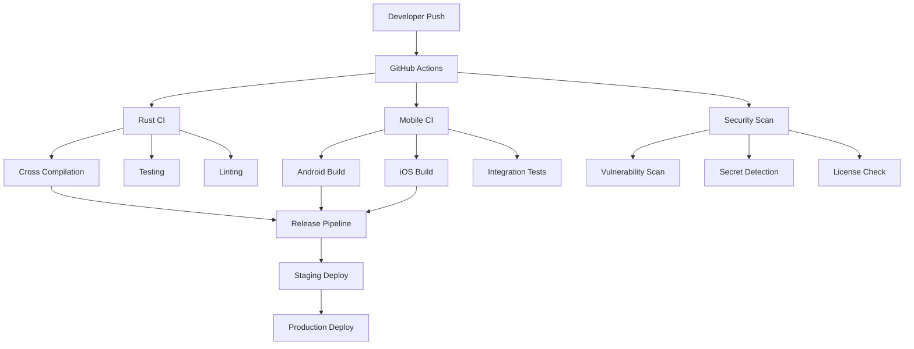

# WriteMagic CI/CD Pipeline Documentation

This document provides a comprehensive overview of the CI/CD pipeline setup for WriteMagic, a cross-platform AI-powered writing application.

## Table of Contents

- [Overview](#overview)
- [Architecture](#architecture)
- [Workflows](#workflows)
- [Development Environment](#development-environment)
- [Security](#security)
- [Monitoring](#monitoring)
- [Deployment](#deployment)
- [Troubleshooting](#troubleshooting)

## Overview

The WriteMagic CI/CD pipeline is designed to support a multi-language, cross-platform application with the following components:

- **Rust Core**: Shared business logic with FFI bindings
- **Android App**: Native Kotlin/Compose application
- **iOS App**: Native Swift/SwiftUI application
- **Infrastructure**: Docker containers and Kubernetes deployments

## Architecture



## Workflows

### 1. Rust CI (`rust-ci.yml`)

**Triggered on**: Push/PR to `main`/`develop` affecting Rust code

**Jobs**:
- **Test Suite**: Runs tests on stable and beta Rust
- **Linting**: Clippy, rustfmt, and unused dependency checks
- **Security**: Cargo audit and deny checks
- **Cross Compilation**: Builds for all target platforms
- **Coverage**: Generates code coverage reports
- **Benchmarks**: Performance benchmarking (main branch only)

**Key Features**:
- Multi-target cross-compilation (Android, iOS, Linux, macOS, Windows)
- Dependency caching for faster builds
- Strict linting with `-D warnings`
- Security vulnerability scanning

### 2. Mobile CI (`mobile-ci.yml`)

**Triggered on**: Push/PR affecting mobile code

**Jobs**:
- **Android Build**: Gradle build with native library integration
- **iOS Build**: Xcode build with Rust FFI (macOS runners only)
- **Linting**: Ktlint for Kotlin, SwiftLint for Swift
- **Testing**: Unit and instrumented tests
- **Integration Tests**: Cross-platform FFI validation
- **Security Scan**: Mobile-specific security analysis

**Key Features**:
- Native library integration from Rust builds
- Emulator testing for Android
- Simulator testing for iOS
- APK/IPA artifact generation

### 3. Security Scanning (`security.yml`)

**Triggered on**: Push/PR, weekly schedule

**Jobs**:
- **Rust Security**: Cargo audit for vulnerabilities
- **Dependency Scanning**: Snyk integration
- **Secret Scanning**: detect-secrets baseline validation
- **Code Scanning**: GitHub CodeQL analysis
- **Container Scanning**: Trivy and Hadolint
- **Mobile Security**: MobSF scanning for APKs
- **License Compliance**: License compatibility checks

### 4. Release Pipeline (`release.yml`)

**Triggered on**: Version tags (`v*.*.*`) or manual dispatch

**Jobs**:
- **Version Management**: Automated version bumping
- **Multi-platform Builds**: All target platforms
- **Docker Images**: Multi-arch container builds
- **Release Creation**: GitHub release with artifacts
- **Deployment**: Staging and production deployments

## Development Environment

### DevContainer Setup

The project includes a complete development container with:

- **Rust toolchain** with all cross-compilation targets
- **Android SDK/NDK** for mobile development
- **Development tools** (clippy, rustfmt, cargo-audit, etc.)
- **Git hooks** and pre-commit validation
- **VS Code configuration** with optimal settings

**Quick Start**:
```bash
# Open in VS Code with Dev Containers extension
code .
# Container will build automatically with all dependencies
```

### Local Development

**Prerequisites**:
- Rust 1.70+ with cross-compilation targets
- Android SDK/NDK (for Android development)
- Xcode (for iOS development on macOS)
- Docker (for containerized development)

**Setup**:
```bash
# Run the setup script
./scripts/dev/setup.sh

# Install pre-commit hooks
pre-commit install

# Build all components
./scripts/dev/build-all.sh

# Run all tests
./scripts/dev/test-all.sh
```

### Pre-commit Hooks

Automated validation on every commit:

- **Rust**: Format, lint, and check compilation
- **Mobile**: Kotlin/Swift formatting and linting
- **Conventional Commits**: Enforce commit message format
- **Security**: Secret scanning and vulnerability checks
- **General**: Trailing whitespace, file size limits

## Security

### Vulnerability Management

1. **Rust Dependencies**: `cargo audit` checks for known vulnerabilities
2. **Third-party Dependencies**: Snyk integration for comprehensive scanning
3. **Container Security**: Trivy scans for OS and application vulnerabilities
4. **Secret Detection**: Automated scanning for hardcoded credentials

### Supply Chain Security

- **Dependency Pinning**: Lock files ensure reproducible builds
- **License Compliance**: Automated license compatibility checks
- **Signed Releases**: All releases include checksums and signatures
- **SBOM Generation**: Software Bill of Materials for transparency

### Access Control

- **Branch Protection**: Required status checks and reviews
- **Environment Secrets**: Separate staging/production credentials
- **OIDC Integration**: Keyless authentication where possible
- **Audit Logging**: All CI/CD actions are logged and monitored

## Monitoring

### CI/CD Metrics

- **Build Times**: Track performance across all pipelines
- **Success Rates**: Monitor failure patterns and trends
- **Security Alerts**: Real-time vulnerability notifications
- **Resource Usage**: Track runner costs and optimization opportunities

### Application Monitoring

- **Prometheus**: Metrics collection and alerting
- **Grafana**: Visualization and dashboards
- **Jaeger**: Distributed tracing for performance analysis
- **Logs**: Centralized logging with structured formats

### Alerting

- **Pipeline Failures**: Immediate notifications for broken builds
- **Security Issues**: Critical vulnerability alerts
- **Performance Degradation**: Benchmark regression detection
- **Deployment Status**: Success/failure notifications

## Deployment

### Environments

1. **Development**: Feature branches with preview deployments
2. **Staging**: Pre-production testing environment
3. **Production**: Live application deployment

### Deployment Strategy

- **Blue-Green Deployments**: Zero-downtime production updates
- **Canary Releases**: Gradual rollout with monitoring
- **Rollback Procedures**: Automated rollback on failure detection
- **Database Migrations**: Safe, reversible schema changes

### Infrastructure as Code

```yaml
# Kubernetes deployment example
apiVersion: apps/v1
kind: Deployment
metadata:
  name: writemagic-app
spec:
  replicas: 3
  selector:
    matchLabels:
      app: writemagic
  template:
    spec:
      containers:
      - name: writemagic
        image: ghcr.io/writemagic/writemagic:latest
        ports:
        - containerPort: 8080
        env:
        - name: RUST_LOG
          value: info
```

### Mobile App Distribution

- **Android**: Google Play Store with staged rollouts
- **iOS**: App Store Connect with TestFlight beta testing
- **Internal Testing**: Firebase App Distribution for QA

## Troubleshooting

### Common Issues

1. **Cross-compilation Failures**:
   ```bash
   # Install missing targets
   rustup target add aarch64-linux-android
   
   # Check NDK configuration
   echo $ANDROID_NDK_HOME
   ```

2. **Test Failures**:
   ```bash
   # Run specific test with verbose output
   cargo test --package writemagic-core --verbose
   
   # Check test environment
   RUST_LOG=debug cargo test
   ```

3. **Build Cache Issues**:
   ```bash
   # Clear Cargo cache
   cargo clean
   
   # Reset git state
   git clean -fdx
   ```

### Performance Optimization

- **Dependency Caching**: Uses GitHub Actions cache for faster builds
- **Incremental Compilation**: Optimized Rust build settings
- **Parallel Testing**: Tests run in parallel where possible
- **Resource Allocation**: Appropriate runner sizes for different tasks

### Debugging CI Failures

1. **Check Logs**: Review detailed output in GitHub Actions
2. **Reproduce Locally**: Use same commands in dev environment
3. **Cache Issues**: Clear caches if builds become inconsistent
4. **Environment Differences**: Verify local matches CI environment

## Contributing

### Adding New Workflows

1. Create workflow file in `.github/workflows/`
2. Follow naming convention: `feature-type.yml`
3. Include proper documentation and comments
4. Test with `act` or similar local runner
5. Update this documentation

### Modifying Existing Workflows

1. Test changes in feature branch
2. Verify all job dependencies
3. Check resource usage impact
4. Update related documentation
5. Monitor first production run

### Security Considerations

- Never commit secrets or credentials
- Use GitHub secrets for sensitive data
- Review security scan results regularly
- Keep dependencies up to date
- Follow principle of least privilege

## References

- [GitHub Actions Documentation](https://docs.github.com/en/actions)
- [Rust Cross-compilation Guide](https://rust-lang.github.io/rustup/cross-compilation.html)
- [Android CI/CD Best Practices](https://developer.android.com/studio/projects/continuous-integration)
- [iOS CI/CD with GitHub Actions](https://docs.github.com/en/actions/guides/building-and-testing-swift)
- [Container Security Best Practices](https://docs.docker.com/develop/security-best-practices/)

---

**Last Updated**: 2024-01-01  
**Version**: 1.0.0  
**Maintainer**: @devops-platform-engineer